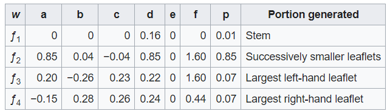

# The scripts

This README gives a brief overview about all provided scripts and their respective tasks. For even more detailed description on the code, please refer to the respective script itself

-------

### ! Important note !

The task-specific elements (only being `RealConsumer` and `RealProducer`) can be easily replaced by other task-specific implementations without the need to change all other scripts

  

-------

## <a href="Buffer.h" target="_blank">`Buffer.h`</a>

Implements a class that is responsible for the ring buffer consumers and producers use. `pushItem()` and `popItem()` are saved by respective <a href="https://en.cppreference.com/w/cpp/thread/condition_variable" target="_blank">`condition variables`</a>. If the buffer is filled to the max, then all producers wait until new space is available (if a consumer takes out an object). If now consumers are provided, then all producers will wait forever (infinitive loop).

Given functioanilities:
- `pushItem()` - pushes given item (reference) into Buffer
- `popItem()` - gets last item (being the first that was pushed in) from the Buffer
- `resetBuffer()` - resets the whole Buffer be resetting both indizes (`head` and `tail`)
- `isEmpty()` - checks if Buffer is empty
- `isFull()` - checks if Buffer is full
- `getCapacity()` - returns capacity of Buffer
- `getElementCount()` - returns the number of elements in Buffer

Special: 
- `popItem()` has a timeout. This is important to be able to end a respective consumer. Otherwise all consumers would work infinitively long. Every consumer stops itself if the buffer is empty for a given amount of time (here 1.5s) --> throws Runtime Error afterwards
- Data-Type of stored obejcts can be chosen via given `<template T>`

  

-------

## <a href="CImg.h" target="_blank">`CImg.h`</a>

Header responsible for all Image manipulations that are needed for rendering of the resulting Fern

  

-------

## <a href="CMakeLists.txt" target="_blank">`CMakeLists.txt`</a>

CMake file, responsible for compiling. Gets called by <a href="../Makefile" target="_blank">`Makefile`</a>

  

-------

## <a href="Consumer.h" target="_blank">`Consumer.h`</a>

Implements a class for a basic `Consumer` in the producer - consumer model. Does not contain task-specific functionality (concerning the BarsnleyFern), defining the abstract functionality of a Consumer, being the parent class of `RealConsumer`, inheriting from `Worker`. Is a `<template T>` class because of the DataType of the Points (that is changing the type of the `Buffer`)

Given functionality:
- `step()` - takes virtual class `step()` from `Worker` and implements it --> worker function that does the actual work
- `consume()` - abstract function that gets overwritten by `RealConsumer`, consuming the provided elements from the buffer
- `finishWork()` - abstract function that finishes the work after all `Consumer`s have done their tasks

Special:
- `step()` is responsible to stop the producers. Catches the Runtime Error thrown by the `Buffer`. Stops respective producer afterwards

  

-------

## <a href="Point.cpp" target="_blank">`Point.cpp`</a>

Implements the Point objects (used by `RealProducer` and `RealConsumer`). Here a point consists of a pair of floats.

Given functionality:
- `getNextPoint()` - determines the next point, depending on current point and given distribution. In here, the four affine transformations (shown below) are implemented

<h2 align="center">
  
</h2>

-------

## <a href="Point.h" target="_blank">`Point.h`</a>

Header of `Point.cpp`

  

-------

## <a href="Producer.h" target="_blank">`Producer.h`</a>

Implements a class for a basic `Producer` in the producer - consumer model. Does not contain task-specific functionality (concerning the BarsnleyFern), defining the abstract functionality of a Producer, being the parent class of `RealProducer`, inheriting from `Worker`. Is a `<template T>` class because of the DataType of the Points (that is changing the type of the `Buffer`)

Given functionality:
- `step()` - takes virtual function `step()` from `Worker` and overwrites it by implementing --> worker function that does the actual work
- `consume()` - abstract function that gets overwritten by `RealProducer`, producing the elements, pushing the into the buffer

Special:
- `step()` is responsible to stop the producers. Trigger to stop the producers is given by `RealProducer` (if the respective one has produced enough elements)

  

-------

## <a href="RealConsumer.cpp" target="_blank">`RealConsumer.cpp`</a>

Implements the RealConsumer, doing the task-specific consuming actions, inherits from `Consumer`. Resulting image has a resolution of 10k x 20k pixels in `.png` format. Uses one mutex per row (= 10k mutexes) to make parallel writing on one single iamge threadsafe

Given functionality:
- `consume()` - takes virtual function `consume()` from `Consumer` and overwrites it by implementing --> does the actual consume: Takes the data points provided by the `Producer`s via the `Buffer` and draws them respectively onto the resulting photo
- `finishWork()` - takes virtual function `finishWork()` from `Consumer` and overwrites it by implementing --> saves the image that has been drawn. Only done once, by last `RealConsumer`
- `createImage()` - initializes the iamge that shall be drawn (only done once, saved by mutex)
- `convert2Pixel()` - converts the given point (from `Producer`, respective `Buffer`) and converts it into pixel values for the image. Performs a scaling and bias on x and y, depending on desired image size

-------

## <a href="RealConsumer.h" target="_blank">`RealConsumer.h`</a>

Header of `RealConsumer.cpp`

  

-------

## <a href="RealProducer.h" target="_blank">`RealProducer.h`</a>

Implements the RealProducer, doing the task-specific consuming actions, inherits from `Producer`

Given functionality:
- `produce()` - takes virtual function `produce()` from `Producer` and overwrites it by implementing --> does the actual produce: calculates new points that shall be drawn onto the picture given the respective affine transformations in `Point.cpp`

Special:
- `produce()` is responsible to stop the Producers when enough points (here 10^8) are calculated and stored in the Buffer

  

-------

## <a href="Worker.cpp" target="_blank">`Worker.cpp`</a>

Implements a class for a basic `Worker`. Does not contain task-specific functionality (concerning the BarsnleyFern), defining the abstract functionality of a Worker, being the parent class of `Consumer` and `Producer`. Implementing the actual parallelism of the whole project. Is aware of starting, stopping and regularly calling the seperate Workers

Given functionality:
- `join()` - joins the the thread (that has been initialized and started by `start()`). Waiting for respective thread to finish before calling `stop()` and finishing the Worker
- `start()` - initializing and starting the actual thread
- `stop()` - stopping the thread, deconstructing it
- `work()` - actual working function that gets called by `start()`. Runs whatever gets implemented in abstract function `step()`
- `isRunning()` - checks if Worker is already running
- `isTerminated()` - checks if Worker is terminated
- `step()` - abstract function that gets overwritten by `Producer` respective `Consumer`, performing the actual algorithm

-------

## <a href="Worker.h" target="_blank">`Worker.h`</a>

Header of `Worker.cpp`

  

-------

## <a href="main.cpp" target="_blank">`main.cpp`</a>

Main function of the whole project. Defines number of consumers and producers (here both to be 2), initialises Buffer, RealConsumers and RealProducers and starts the latter.